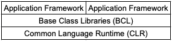

C# is an object-oriented programming language, but it also borrows a lot from functional programming.
C# is primarily a type-safe language. You can't interact with a _string_ type, as though it was an _integer_ type. By using the _dynamic_ keyword, C# allows you to use dynamically typed programming.

## Memory Management

C# allows for the use of pointers in code blocks marked as unsafe, since C# eliminates the need for pointers.
Read more [here](https://docs.microsoft.com/en-us/dotnet/csharp/language-reference/keywords/unsafe).

## Platform Support

C# supports the following platforms:

* .NET Core enables web application development in Linux, Mac OS, and Windows.
* Xamarin enables mobile application programming for IOS and Android.
* Blazor compiles C# to WebAssembly that can run in the browser.
* .NET Core 3 enables rich-client and web application development on Windows 7 to 10.
* Universal Windows Platform (UWP) supports Windows 10 desktop and devices such as: Xbox, Surface, and HoloLens.

## C# and the Common Language Runtime

The Common Language Runtime (CLR) provides _automatic memory management_ and _exception handling_. The word common means that the same runtime can be shared between other _managed_ programming languages, such as: F#, Visual Basic, and Managed C++.

C# converts source code into managed code, which is represented in _Intermediate Language_ (IL). Using _Just-In-Time_ (JIT) compilatione, the CLR converts the IL into the native code for the machine, either x86 or x64. If you want to improve startup time for lage assemblies, or resource-constrained devices, you can use Ahead-of-time compilation. An assembly is an container for not only _IL_ but also for all the type information (metadata). Using _reflection_ a program can query its own metadata.

### Frameworks and Base Class Libraries

A framework consists of 3 layers: the _Base Class Libraries_ (BCL), CLR, and the _Application Framework_ layers. The Application Framework layers contains APIs specific to writing web or rich-client applications.

The CLR sits at the bottom, with the BCL in the middle, and the Application Frameworks at the top. A CLI doesn't need any Application Framework Layer.

There are currently 4 major framework choices:

* .NET Core
* UWP
* Mono + Xamarin
* .NET Framework (superseded by .NET Core 3)

By using ".NET Standard", you can write class libraries that works across multiple frameworks (see chapter 5).